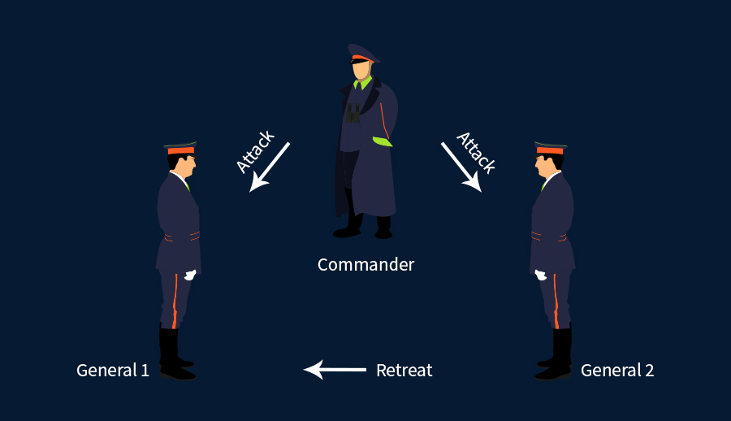
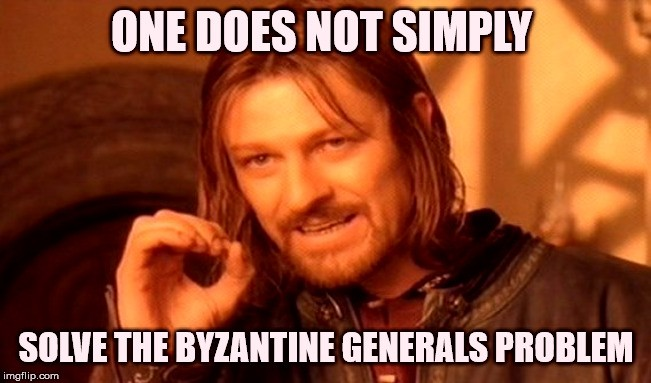
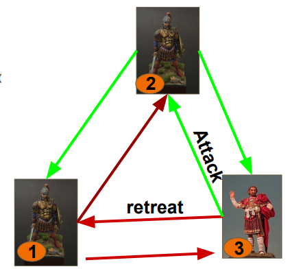

# breakingByzantine
### Because Nothing is Impossible

> This is a Parallel and Distributed computing project. 

## Byzantine's Generals Problem

Byzantine's General Problem is a classical Distributed Computing problem.  It states that, for `N` generals, taking part to reach a consensus, having `M`traitors among them. 

A common decision should be reached even of there are `M` traitors who might collude among them.  
The final consensus should be the majority decision of the `N-M` honest generals.

### Historical Motivation / The story in LSP'82
A Byzantine army decides to attack/ retreat
    - N generals, M of them are traitors (can collude)
    - Generals camp outside the castle
      - Decide individually based on their field information
    - Exchange their plans by messengers
      - Can be killed, can be late, etc
      
**Requirements**
    - All loyal generals agree on the same plan of action
      - E.g will get defeated if not attack together
    - The chosen plan must be proposed by an loyal general
    
## Our Research - Making the impossible possible.  

You must have atleast read the celebrated **Impossibility Result** to continue further:
Reaching Agreement in the Presence of Faults, [PSL'80](https://lamport.azurewebsites.net/pubs/reaching.pdf).

Our research is an imporvement to [The Byzantine Generals Problem - LSP'82](https://www.microsoft.com/en-us/research/uploads/prod/2016/12/The-Byzantine-Generals-Problem.pdf). 
According to this paper, the system can be fault tolerant IFF `M` < 0.33 * `N`.  This means that 
> N > 1 + 3 * M

In other word, a three party byzantine general's problem cannot be fault tolerant if there is atleast one adversary. 

## What did we achieve?
We solved the Three party Byzantine Fault Tolerence, in synchronous (and asynchronous) setup.  

### 1. Our Setup
A general can decide based on their intelligence.

@message = decision
@time = time of decision
@encoded_message = encodeMessage(@message, @time)
@mac = generateHMAC(@encoded_message)

### 2. Message Authentication
Message Authentication Code or MAC in short, is a mechanism to validate the authenticity and integrity of the message.  We have managed the same using Hash Based MAC - HMAC. 

A dishonest General may cheat if she sends different plan of attack to the other two honest general.  

### 3. How can they cheat?
3 generals, third general is traitor. 
* The Traitor sends different plans
* If decision is based on majority
    * (1) and (2) decide differently 
    * (2) attacks and gets defeated

### 4. How can we prevent cheating?
We observed that they can only cheat if they send different message. This would imply that they would have to calculate two different MAC for those two messages.  
Our idea was to implement a Cost Based system in which we bring in`@coins`, and `k` coins are used for generating a valid HMAC. A general would have only sufficient `@coins` to calculate HMAC.

Therefore we end up preventing a traitor from sending different plans of attack, and thereby saving the Byzantine's army from horrible defeat.

This can be extended to N-party Byzantine Distributed Consensus. 

# Contributors

1. S Ashwin Shenoi - [@c3rb3ru5](https://twitter.com/__c3rb3ru5__)
2. Mahesh Hari Sharma - [@shashb4sh](https://twitter.com/slashb4sh)
3. Sayooj Samuel - [@sayoojsamuel](https://twitter.com/sayoojsamuel)

With Love, [@teambi0s](https://twitter.com/teambi0s) 
